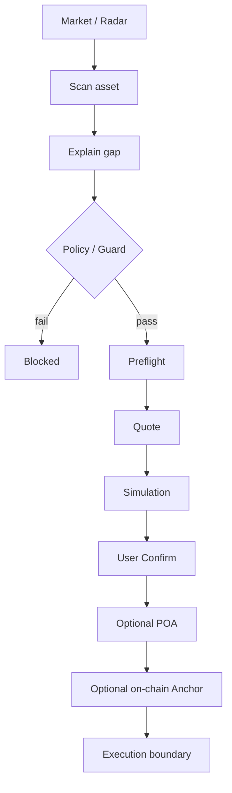
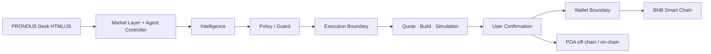

# PRONOUS

<div align="center">

**AGENT UTILITY + TOKENIZED STOCK MARKET DESK ON BSC**

[](https://www.bnbchain.org/en/hackathons/tokenized-stocks)
[](./api/agent.js)
[](./docs/PRODUCT.md)
[](./docs/POA_ONCHAIN.md)
[](LICENSE)

**Watch → Compare → Explain → Guard → Prepare → Confirm**

[Live App](https://pronous.vercel.app/) · [**Submission**](docs/SUBMISSION.md) · [Hackathon](docs/HACKATHON.md) · [DevEx](docs/DEVEX_REPORT.md) · [Product](docs/PRODUCT.md) · [On-chain POA](docs/POA_ONCHAIN.md) · [Demo](docs/DEMO_VIDEO.md)

</div>

---

## About

PRONOUS is an **agent utility layer** and **market desk** for tokenized equities on **BNB Smart Chain**.

The core principle is simple:

> The agent may observe, explain, and prepare — but a market signal is never permission to spend.

PRONOUS separates **observation**, **decision**, **execution**, and **proof**. Guards, simulation, and explicit user confirmation sit between the agent and the chain. Optional **Proof of Action (POA)** can stay off-chain (hash only) or be **anchored on-chain** — the user pays **BNB gas only**; swaps are not broadcast by the anchor.

---

## Core workflow



| Step | What happens |
|------|----------------|
| **Watch** | Tokenized-stock universe + market status |
| **Compare** | Token price vs reference price |
| **Explain** | Gap, premium/discount, market context |
| **Guard** | Network, asset, spot-only, spend cap |
| **Prepare** | Structured spot intent (no broadcast) |
| **Confirm** | Simulation + explicit wallet approval |
| **Prove** | POA hash · optional BSC anchor (gas only) |

---

## Agent path

```text
Observe → Detect → Verify → Guard → Plan → (Simulate) → Confirm → Prove
```

1. Agent / MCP tool scans the market or a ticker (e.g. NVDA).
2. Intelligence explains token vs reference gap.
3. Policy checks network (BSC 56), asset allowlist, spot-only, spend cap.
4. Preflight + quote build a constrained intent.
5. Simulation is required before any live path.
6. User remains the final confirmation boundary.
7. POA records the action hash; optional **PoaAnchor** writes it on-chain.

**MCP (one paste):**

```json
{
  "mcpServers": {
    "pronous": {
      "command": "npx",
      "args": ["-y", "github:wadezigh96/pronous"]
    }
  }
}
```

> Use PRONOUS to scan NVDA and explain the token/reference gap.

Tools: `market_assets` · `scan_asset` · `preflight` · `ask_pronous` — [MCP setup](docs/MCP.md)

---

## Safety boundaries

| Layer | Responsibility |
|-------|----------------|
| **Network** | BSC mainnet only (`chainId = 56`) |
| **Asset** | Ondo / bStocks / xStocks only |
| **Spot** | No leverage / perps |
| **Price** | Token + reference required |
| **Quality** | Large gaps marked unreliable |
| **Spend cap** | Intent must fit the cap |
| **Simulation** | Required before live action |
| **Confirmation** | User is the last approval |
| **POA anchor** | Attestation only — not a swap |
| **Broadcast** | Server-side live execution stays off until gates pass |

A market gap alone never authorizes spending. AI / agent logic is not a security boundary; policy + user confirmation remain the enforcement layer.

---

## Architecture



Live API checks:

- https://pronous.vercel.app/api/agent?action=authcheck
- https://pronous.vercel.app/api/agent?action=assets
- https://pronous.vercel.app/api/agent?action=radar
- https://pronous.vercel.app/api/agent?action=scan&ticker=NVDA

---

## On-chain POA (live)

| Item | Link |
|------|------|
| **Contract** | [`0xD729eFf0E050195D464cC9597d7A5Cc7194911B5`](https://bscscan.com/address/0xD729eFf0E050195D464cC9597d7A5Cc7194911B5) |
| **Evidence** | [docs/SUBMISSION.md](docs/SUBMISSION.md) |
| **How it works** | [docs/POA_ONCHAIN.md](docs/POA_ONCHAIN.md) |

`anchor(poaHash, status, poaId)` — value `0`, user pays gas only. Does not execute swaps.

---

## Project structure

```text
pronous/
├── index.html          # Product dashboard
├── api/                # agent.js · skills · ask
├── lib/                # market · policy · execution
├── agent/              # Agent Studio · Agentic Wallet docs
├── contracts/          # PoaAnchor.sol
└── docs/               # PRODUCT · ARCHITECTURE · SUBMISSION · POA
```

---

## Hackathon alignment

Built for [BNB Hack: Tokenized Stocks Edition](https://www.bnbchain.org/en/hackathons/tokenized-stocks) (16 Sep – 11 Oct 2026).

- **bStocks / Ondo / xStocks** universe · **BSC mainnet** · **spot only**
- Binance Web3 market + quote adapters
- Agentic Wallet / Wallet Skills as execution boundary
- BNB Agent Studio + x402 as hosted-agent path
- Live broadcast gated until simulation + user confirmation

Judges: public repo · deployed app · [DevEx report](docs/DEVEX_REPORT.md) · demo video — [DEMO_VIDEO.md](docs/DEMO_VIDEO.md)

---

## Quick start

```text
BINANCE_WEB3_API_KEY=
BINANCE_WEB3_API_SECRET=
BINANCE_WEB3_SIGN_ALGO=HMAC_SHA256
BINANCE_WEB3_RECV_WINDOW=5000
```

Deploy to Vercel (or any serverless JS host). Never commit secrets.

- [agent/AGENT_STUDIO_DEPLOY.md](agent/AGENT_STUDIO_DEPLOY.md)
- [agent/AGENTIC_WALLET.md](agent/AGENTIC_WALLET.md)

---

## Status

**Active build.** Market intelligence live · execution planning guarded · server-side broadcast off · POA anchor live on BSC.

## License

[MIT](LICENSE)
