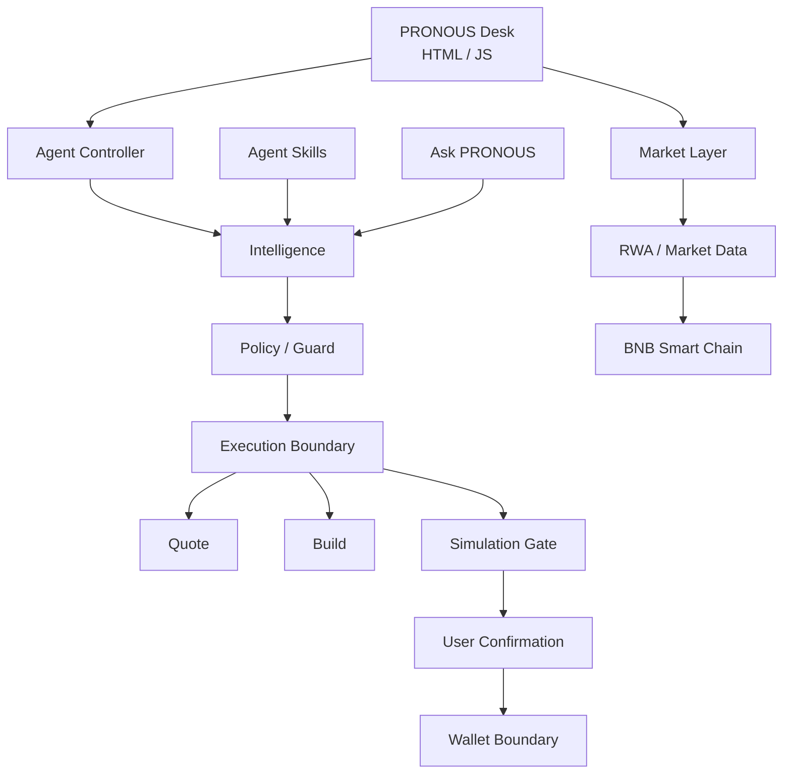

# PRONOUS

<div align="center">

**TOKENIZED STOCK MARKET DESK**

[](https://www.bnbchain.org/)
[](./index.html)
[](./api/agent.js)
[](./docs/PRODUCT.md)
[](LICENSE)

**Watch → Compare → Explain → Guard → Prepare → Confirm**

[Live App](https://pronous.vercel.app/) · [Architecture](docs/ARCHITECTURE.md) · [Product](docs/PRODUCT.md) · [Design](docs/DESIGN.md)

</div>

---

## Connect PRONOUS MCP

**One copy. One connection. PRONOUS inside your AI client.**

```json
{
  "mcpServers": {
    "pronous": {
      "command": "npx",
      "args": ["-y", "github:wadezigh96/pronous"]
    }
  }
}
```

Then ask:

> **Use PRONOUS to scan NVDA and explain the token/reference gap.**

**Tools:** `market_assets` · `scan_asset` · `preflight` · `ask_pronous`

[Full MCP setup →](docs/MCP.md)

---

## What is PRONOUS?

PRONOUS is a focused on-chain market desk for **tokenized stocks on BNB Smart Chain**.

> **See the token price, compare it with the reference price, understand the gap, then decide what happens next.**

PRONOUS separates market intelligence from execution. A market signal is not permission to spend.

## The core loop

**WATCH → COMPARE → EXPLAIN → GUARD → PREPARE → CONFIRM**

| Step | PRONOUS |
|---|---|
| Watch | Tokenized-stock universe and market status |
| Compare | Token price vs. reference price |
| Explain | Gap, premium/discount and market-state context |
| Guard | Spot-only rules, spend limits and asset checks |
| Prepare | Structured execution intent |
| Confirm | Simulation and explicit wallet confirmation |

---

## Product surfaces

### Market Desk

A compact terminal for tokenized equities.

- Asset universe
- Token/reference prices
- Spread percentage
- Market status
- Next open / close
- Platform and token metadata

### Divergence Radar

Finds the largest observed token/reference gaps so the user can inspect them instead of searching manually.

### Asset Detail

Click an asset to inspect token price, reference price, spread, market state, volume, market cap, token contract and share ratio.

### Agent Console

PRONOUS turns an observation into a constrained plan.

**Observe → Detect → Verify → Guard → Plan**

### Execution Cockpit

Execution is intentionally staged:

**Preflight → Quote → Simulation → Confirmation → Execution**

No blank-check transaction flow.

### Ask PRONOUS

A lightweight 24/7 assistant explains tokenized stocks, market hours, gaps, BSC and the execution model.

---

## Architecture



### Repository layers

```text
PRONOUS/
├── index.html              # Product dashboard
│
├── api/
│   ├── agent.js            # Agent / market API controller
│   ├── skills.js           # Skills API controller
│   └── ask.js              # Assistant API controller
│
├── lib/
│   ├── market.js           # Asset normalization + spread logic
│   ├── policy.js           # Deterministic safety checks
│   ├── skills.js           # Skill registry + routing
│   └── execution.js        # Quote/build/simulation boundary
│
├── agent/
│   ├── AGENTIC_WALLET.md
│   ├── AGENT_STUDIO_DEPLOY.md
│   └── task-schema.json
│
└── docs/
    ├── ARCHITECTURE.md
    ├── DESIGN.md
    └── PRODUCT.md
```

---

## Safety model

PRONOUS uses explicit gates:

| Gate | Purpose |
|---|---|
| **Network** | BNB Smart Chain |
| **Asset** | Resolve a supported tokenized asset |
| **Spot** | No leverage / perps in the execution policy |
| **Price** | Require token + reference price |
| **Spend cap** | Keep intent inside a defined limit |
| **Simulation** | Required before live action |
| **Confirmation** | User remains the final approval boundary |

Execution state:

```text
BLOCKED
   ↓
READY_FOR_QUOTE
   ↓
READY_FOR_SIMULATION
   ↓
WAITING_CONFIRMATION
   ↓
READY_TO_EXECUTE
```

Live broadcast remains deliberately gated while transaction schemas and wallet execution are verified.

---

## Integrations

PRONOUS is structured around the Binance Web3 stack relevant to tokenized stocks:

- RWA / market data
- Trading and aggregated quote flows
- Wallet state
- Agentic Wallet / Wallet Skills
- BNB Agent Studio
- x402 integration path

The application keeps these integrations behind clear domain boundaries so market data does not become automatic transaction permission.

---

## Design language

PRONOUS uses a compact product-terminal style:

- Dark neutral workspace
- Gold BNB accent
- Thin borders
- Dense information hierarchy
- Inter for product copy
- IBM Plex Mono for system/data labels
- Explicit system states
- Mobile-responsive layout

The goal is **utility first**: every panel should answer what the asset is, what the gap is, what the market state is, and what can happen next.

See [docs/DESIGN.md](docs/DESIGN.md).

---

## Quick start

Set the server-side environment variables:

```text
BINANCE_WEB3_API_KEY
BINANCE_WEB3_API_SECRET
BINANCE_WEB3_SIGN_ALGO
BINANCE_WEB3_RECV_WINDOW   # optional
```

Then deploy the repository to a serverless JavaScript environment such as Vercel.

For Agent Studio setup, see:

- [agent/AGENT_STUDIO_DEPLOY.md](agent/AGENT_STUDIO_DEPLOY.md)
- [agent/AGENTIC_WALLET.md](agent/AGENTIC_WALLET.md)

---

## Status

**Active build.**

The primary product surface is market intelligence, asset analysis and guarded execution planning. Live execution is deliberately separated behind policy, simulation and user confirmation.

## License

See [LICENSE](LICENSE).
